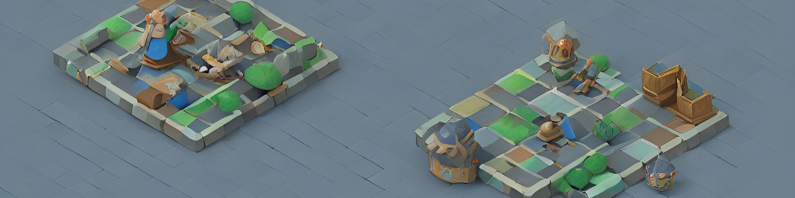

# Battle of the Centerländ - Editor - Team 11

**Battle of the Centerländ - Editor**
benutzt [Electron React Boilerplate](https://electron-react-boilerplate.js.org/docs/installation), [Electron](https://electron.atom.io/), [React](https://facebook.github.io/react/), [React Router](https://github.com/reactjs/react-router),[Webpack](https://webpack.js.org/), [React Fast Refresh](https://www.npmjs.com/package/react-refresh)
und [NodeJS](https://nodejs.org/en/).

## Projektstruktur

Das Projekt ist in mehrere Ordner unterteilt:

- `src` - Enthält den Quellcode der Anwendung
- `src/__tests__` - Enthält die Tests des Projekts
- `src/main` - Enthält den Quellcode der Main Prozesses
- `src/renderer` - Enthält den Quellcode der Renderer Prozesses
- `assets` - Enthält die Assets der Anwendung
- `docs` - Enthält die Dokumentation des Projekts
- `manual` - Enthält das Entwicklerhandbuch
- `release/build` - Enthält die gebauten Versionen der Anwendung

## Projekt installieren

Da das Projekt in [NodeJS](https://nodejs.org/en/) geschrieben ist, muss NodeJS installiert sein:

[Download NodeJS](https://nodejs.org/en/download/)

Nachdem NodeJS installiert ist, kann das Projekt installiert werden. Dazu muss das Projekt geklont werden und die
Abhängigkeiten installiert werden:

```bash
git clone https://gitlab.uni-ulm.de/softwaregrundprojekt/2022-2023/messe/editor/messe-editor-team-11.git
cd messe-editor-team-11
npm i -g ts ts-node
npm install
```

## Entwicklung starten

Starte die App in der `dev` Umgebung mit:

```bash
npm start
```

## App bauen

Um die App für die aktuelle Plattform bauen zu lassen (Windows, Linux, macOS):

```bash
npm run package
```

## Dokumentation

Siehe [hier](https://electron-react-boilerplate.js.org/docs/installation) für Dokumentationen und Leitfäden für
Electron-React-Boilderplate, auf dem dieses Projekt basiert.

Für die Projektdokumentation bitte das Entwicklerhandbuch benutzen `manual/Entwickler-Handbuch.pdf`, oder die Markdown
Dateien im `docs` Ordner

## Programmierung

Der Editor ist mithilfe der IDE [WebStorm](https://www.jetbrains.com/de-de/webstorm/) geschrieben worden. Um die
Entwicklungsumgebung zu nutzen, muss die IDE installiert sein. Die IDE kann über den folgenden Link heruntergeladen
werden:

> Windows [Download WebStorm](https://www.jetbrains.com/de-de/webstorm/download/#section=windows)

> Ubuntu [Download WebStorm](https://www.jetbrains.com/de-de/webstorm/download/#section=linux)
> oder über den Snap Store `sudo snap install webstorm --classic`

> macOS [Download WebStorm](https://www.jetbrains.com/de-de/webstorm/download/#section=mac)

Nachdem die IDE installiert ist, kann das Projekt geöffnet werden. Dazu muss der Ordner `messe-editor-team-11` als
Projekt geöffnet werden. Nachdem das Projekt geöffnet ist, kann die IDE genutzt werden.

## Tests ausführen

Die Tests für die Anwendung führt eine Bibliothek namens *jest* aus. Zum ausführen der Tests folgenden Command in einer
CMD ausführen:

```
npm run test 
```

## Code Coverage

Die Code Coverage wird mit *jest* und *istanbul* berechnet. Zum Ausführen der Code Coverage folgenden Command in einer
CMD ausführen:

```
npm run coverage
```

## Code Style

Der Code Style wird mit *eslint* und *prettier* überprüft durch WebStorm. Die Konfiguration für *eslint* und *prettier*
ist in der Datei `.eslintrc.js` zu finden.

Des Weiteren wird der Code Style mit *SonarLint* überprüft, einem Plugin für WebStorm.

> Installieren von SonarLint: `File > Settings > Plugins > Marketplace > SonarLint`
