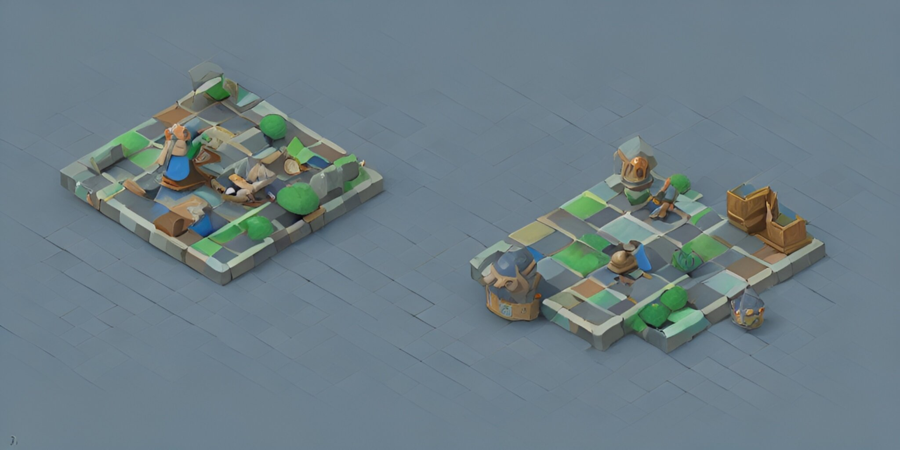

# Battle of the Centerländ - Editor - Team 11

**Battle of the Centerländ - Editor** benutzt <a href="https://electron-react-boilerplate.js.org/docs/installation">Electron React Boilerplate</a>, <a href="https://electron.atom.io/">Electron</a>, <a href="https://facebook.github.io/react/">React</a>, <a href="https://github.com/reactjs/react-router">React Router</a>, <a href="https://webpack.js.org/">Webpack</a>, <a href="https://www.npmjs.com/package/react-refresh">React Fast Refresh</a> und <a href="https://nodejs.org/en/">NodeJS</a>.

## Entwicklung starten

Starte die App in der `dev` Umgebung:

```bash
npm start
# or with yarn
yarn run package
```

## App bauen

Um die App für die aktuelle Plattform bauen zu lassen:

```bash
npm run package
# or with yarn
yarn run package
```

## Docs

Siehe [hier](https://electron-react-boilerplate.js.org/docs/installation) für Dokumentationen und Leitfäden

## Installation

....

## Programmierung

Der Editor ist mithilfe der IDE [WebStorm](https://www.jetbrains.com/de-de/webstorm/) geschrieben
